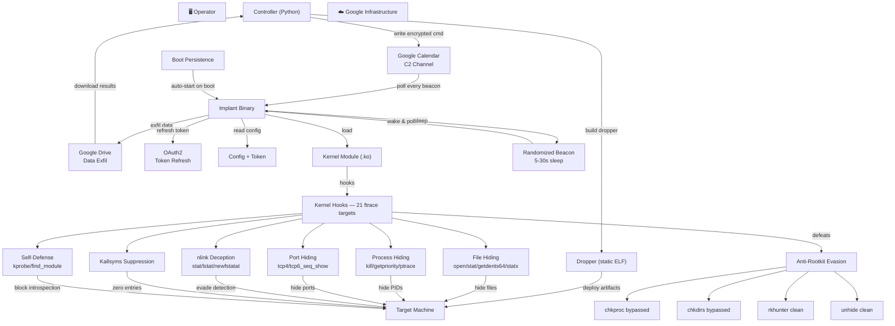

<p align="center">

</p>

<h1 align="center">XUAN</h1>
<p align="center"><code>Kernel-level Linux rootkit · 4.17–6.x · x86_64 · ftrace hooks (24) · Google C2 · Zero non-Google traffic · Self-rebuilds on kernel upgrade · Evades chkrootkit, rkhunter, and unhide</code></p>

## DESCRIPTION

XUAN is a kernel-level rootkit for modern Linux (4.17–6.x) that operates through ftrace-based syscall hooking. Unlike userland rootkits that can be detected by file integrity monitoring or process enumeration, XUAN embeds itself into the kernel's execution path — intercepting filesystem operations, process listings, and network socket enumeration before they reach userspace tools.

The rootkit binary masquerades as a legitimate system component, blending into the noise of hundreds of similar processes on a typical Linux box. Once executed with root privileges, it loads a kernel module that hooks 24 kernel functions via the Linux ftrace framework — a legitimate kernel tracing mechanism repurposed for interception — and auto-starts an integrated kernel-level keylogger. No kernel patching, no DKMS registration, no suspicious entries in `lsmod` or `/sys/module`. The module compiles on-target against the machine's exact kernel headers, ensuring compatibility and leaving no pre-compiled binary signatures. If headers are missing, the dropper auto-installs them via apt, dnf, yum, pacman, or zypper — then retries the build.

Command-and-control runs entirely over Google's infrastructure. The rootkit uses a randomized beacon — verifying internet connectivity before each poll, then sleeping for a configurable interval before checking a shared Google Calendar for encrypted commands embedded in event descriptions. Responses and exfiltrated data flow back through Google Drive. All auxiliary downloads — including the browser extraction binary — are served from Google Drive as well. There are no listening ports, no custom TCP protocols, no DNS tunneling, no direct operator-to-target connections. Every single packet from the rootkit goes to a `google.com` or `googleapis.com` address, indistinguishable from routine browser traffic to Google services. Between beacon cycles, the rootkit generates zero network traffic — complete radio silence. The rootkit discovers its public IP via Google STUN and enriches its C2 heartbeat with detailed system identity.

**What can it do?** Beyond standard shell access, XUAN includes purpose-built modules for: browser credential extraction, Discord token harvesting (Chrome + Firefox + Discord clients), webcam/microphone/screen capture (multi-tool fallback with auto-install), SSH key and known_hosts exfiltration, crypto wallet discovery (40+ paths including browser extension wallets: MetaMask, Phantom, Coinbase Wallet, Rabby, Ronin across Chrome/Chromium/Brave/Edge/Opera/Vivaldi), WiFi password extraction, clipboard monitoring (Wayland + X11), shell history collection (bash, zsh, ksh, fish), process enumeration with kernel thread filtering, network connection listing with process resolution, environment variable extraction (from /proc/*/environ, .env files, config files, and systemd service definitions), cloud credential theft (AWS, GCP credentials.db + ADC + legacy, Azure profile/tokens/MSAL cache, K8s, Docker, DigitalOcean, Terraform), SSH agent key hijacking across 5+ socket locations, mount/disk enumeration, and a kernel-level keylogger that captures keystrokes before they reach userspace.

**How does it stay hidden?** Every installed artifact is machine-specific. No two infected machines share the same binary name, module path, persistence entry, or config directory. File timestamps are cloned from legitimate system files to resist forensic timeline analysis. The kernel module auto-hides all rootkit paths on every boot and whitelists its own PID so the rootkit can read its configuration while remaining invisible to `find`, `ls`, `ps`, `top`, `netstat`, and any EDR scanning `/proc`. Rootkit detection tools — including **chkrootkit**, **rkhunter**, and **unhide** — return clean results with zero warnings. Full merged-usr support ensures paths are correctly hidden whether `/lib` is a symlink to `/usr/lib` or not.

**Persistence** is maintained through a hidden startup mechanism that executes on system initialization and sources the user's shell profiles so environment variables propagate correctly. The dropper binary is a single statically-linked ELF — no dependencies, no package manager noise beyond optional kernel header installation. Between the machine-specific naming, timestamp cloning, ELF header corruption, and binary obfuscation, static analysis of the dropper yields nothing actionable. The dropper persists the module source tarball so the rootkit can self-rebuild after kernel upgrades without external intervention.

---

## Architecture


## Features

### C2 Commands
| Command | Description |
|---|---|
| `cd`, `pwd`, `ls` ... | Full shell access via startup context |
| `upload <file_dir> <dest_dir>` | Download file/folder from Drive to target path |
| `download <path>` | Tar and exfil file/directory from target to Drive |
| `execute <file_dir>` | Download Python script from Drive by file_id, run on target |
| `dump_browser` | Extract browser passwords, cookies, autofill, history |
| `dump_token` | Extract Discord authentication tokens |
| `dump_camera <count>` | Capture webcam photos (1–20) |
| `screenshot` | Capture desktop screenshot |
| `dump_audio <seconds>` | Record microphone (1–60 seconds) |
| `dump_wifi` | Extract saved WiFi SSIDs and passwords |
| `dump_clipboard` | Capture clipboard content (X11 + Wayland) |
| `dump_history` | Collect shell history (bash, zsh, ksh, fish) |
| `dump_ssh` | Exfil SSH keys and known_hosts |
| `dump_crypto` | Scan for and exfil crypto wallet files (40+ paths, browser extensions) |
| `dump_mounts` | List mounted filesystems, disk usage, and physical disks |
| `dump_processes` | Enumerate running processes with PID, user, and command line |
| `dump_netstat` | List active network connections (TCP/UDP, IPv4/IPv6) |
| `dump_env` | Extract sensitive env vars from /proc, .env files, config files, systemd services |
| `dump_cloud` | Extract cloud credentials (AWS, GCP/Azure/DigitalOcean/K8s/Docker/Terraform) |
| `dump_ssh_agent` | List unlocked keys from running SSH agents |
| `keylog dump` | Dump captured keystrokes (static XOR key, survives kernel upgrades) |
| `keylog clear` | Clear the keylog buffer |
| `stealth` | Check kernel module status (active/inactive) |
| `takeover` | Switch rootkit to different C2 calendar |
| `update_token` | Refresh Google Drive API token |
| `reboot` | Reboot the target machine |
| `shutdown` | Shut down the target machine |

### Stealth
- **Syscall hooking** — 16 syscalls intercepted via ftrace before they reach userspace (open, stat, lstat, statx, access, openat, chdir, chmod, chown, getdents64, ptrace, kill, getpriority, newfstatat, finit_module)
- **File hiding** — trie-based prefix matching, both symlink (`/lib/`) and resolved (`/usr/lib/`) paths auto-registered; full-path matching in `getdents64` ensures correct hiding on merged-usr systems
- **Process hiding** — rootkit PID hidden from `/proc`, `ps`, `top`, `kill -0`, `getpriority()`, and brute-force scans
- **Port hiding** — TCP and UDP ports hidden from `netstat`, `ss`, `/proc/net/tcp`, `/proc/net/udp`
- **Module hiding** — kernel module hidden from `lsmod`, `/proc/modules`, `/sys/module`
- **nlink deception** — `stat`/`lstat`/`newfstatat`/`statx` results post-corrected for directories containing hidden subdirectories to defeat link-count based directory enumeration; `/sys/module` nlink decremented to conceal module presence
- **Kallsyms suppression** — module symbol table zeroed after hook installation; `/proc/kallsyms` shows zero entries for `XUAN_core`
- **dmesg sanitization** — all `printk` output stripped from module; `dmesg` returns zero references to XUAN, rootkit, or keylogger
- **Keylogger** — built into the main kernel module, auto-starts on load, captures keystrokes before they reach userspace. XOR-encrypted with a machine-derived static key; survives kernel upgrades. Output stored on disk inside already-hidden directory.
- **Anti-debug** — debugger attachment blocked on rootkit process via ptrace hook
- **finit_module hook** — pass-through (no longer blocks module loads); WiFi drivers and legitimate kernel modules load normally
- **`/proc/<pid>/fd` hidden** — open file descriptors invisible, preventing enumeration of keylogger output and config files
- **Module load retry** — auto-retries kernel module load every 30 seconds if module is inactive; module source tarball persisted to hidden config directory for on-the-fly recompilation
- **Auto-load on boot** — loads automatically on startup, no manual intervention needed
- **Kernel upgrade resilience** — module source tarball persisted to hidden config directory; implant auto-detects kernel version changes and recompiles the module on-the-fly, then reloads it seamlessly
- **Dynamic config reload** — C2 calendar and beacon configuration can be hot-swapped via the `takeover` command

### Anti-Rootkit Evasion

XUAN bypasses all major Linux rootkit detection tools including **chkrootkit** (chkproc, chkdirs), **rkhunter**, and **unhide** (proc, brute). Both `chkrootkit` and `rkhunter` return clean results with no warnings or detections.

### Self-Defense
- **Anti-kprobe** — blocks other tools from attaching kprobes to hooked functions
- **Anti-kallsyms** — `kallsyms_on_each_symbol` hook filters module symbols from kernel symbol enumeration; `num_symtab` zeroed to block `/proc/kallsyms` seq_file path
- **Anti-find_module** — returns NULL for the module, invisible to `/sys/module` probes
- **BPF hook** — pass-through (disabled); blocking BPF broke NetworkManager/systemd-networkd/WiFi authentication
- **Log sanitization** — all `printk` output removed; `dmesg` contains zero module, rootkit, or keylogger references
- **Secret unload** — proc control requires machine-specific key to unload

### Beaconing
- **Randomized intervals** — polls Google Calendar at random intervals between configurable min/max values
- **Configurable per rootkit** — each infected machine can have different beacon timing
- **Network pre-check** — verifies internet connectivity (TCP to 8.8.8.8:53) before each beacon; sleeps if offline
- **Zero traffic between polls** — complete network silence during sleep cycles, no heartbeats or keep-alives
- **Jitter** — random variation within the configured range prevents predictable polling patterns
- **Network profile** — bursts of Google API traffic at irregular intervals, identical to a user manually refreshing Gmail
- **Identity heartbeat** — periodically updates the C2 calendar event with enriched system identity including: hostname, STUN-discovered public IP, MAC address, machine-id, hardware vendor, product name, CPU model/cores, total/free RAM, storage usage, OS distro/kernel/arch, GPU, screen resolution, system uptime, WSL/VM detection, user list, process count/load, and network interfaces
- **Identity auto-refresh** — re-discovers public IP and system state every 5 minutes; auto-updates the C2 calendar event summary
- **Calendar auto-registration** — if no matching C2 event is found, the rootkit creates its own event on the shared calendar with its identity

### Anti-Forensics
- **Machine-specific naming** — every artifact name is unique per host, derived from system identifiers via FNV-1a hash of `/etc/machine-id`
- **Merged-usr support** — all hidden paths auto-registered for both `/lib/`/`/bin/`/`/etc/`/`/opt/` and `/usr/lib/`/`/usr/bin/`/`/usr/etc/`/`/usr/opt/` variants; physical paths resolved via `realpath()` and hidden too, works on both traditional and merged-usr systems
- **Timestamp spoofing** — rootkit files cloned from legitimate system file timestamps
- **ELF corruption** — dropper binary has corrupted ELF header to evade analysis
- **Encrypted module source** — kernel module source XOR-encrypted in dropper binary
- **Binary obfuscation** — dropper strings cleaned, UPX signatures removed

### Build-Time Diversity

Every build and deployment produces unique binary artifacts — no two droppers or kernel modules share the same hash. This defeats hash-based scanners (VirusTotal exact-match) across all deployments.

| Layer | Scope | Mechanism |
|---|---|---|
| Dead-code injection | Per-build + per-machine | 2–3 unique functions with randomized names injected into kernel module sources |
| XOR-key derivation | Per-machine (static) | Keylogger encryption key derived from machine suffix (FNV-1a hash of `/etc/machine-id`); same key across kernel upgrades |
| Dropper encryption key | Per-build | 32-byte XOR key for module source tarball randomized every controller compilation |
| Rootkit binary encryption | Per-build | Full rootkit binary XOR-encrypted before embedding; dropper decrypts on extraction with per-build key |
| Compiler flag jitter | Per-machine | Random optimization level (`-Os`/`-O2`/`-O3`) plus random alignment flags and `-fno-asynchronous-unwind-tables` per target |
| ELF section mutation | Per-machine | Random `.comment` section appended to compiled `.ko` with per-machine poly ID |
| Build path randomization | Per-machine | Randomized `TMPDIR` prevents reproducible build paths |
| Kernel header auto-install | Per-machine | If kernel module compilation fails, auto-installs `linux-headers` via apt, dnf, yum, pacman, or zypper and retries |

**Result:** Every controller build produces a unique dropper. Every machine deployment produces a unique kernel module. No two artifacts anywhere share an MD5/SHA256 hash.


---

### Anti-Rootkit Result:

<details>
<summary><b>chkrootkit output — clean (no rootkit detected)</b></summary>

<br>

```bash
ROOTDIR is `/'
Checking `amd'...                                           not found
Checking `basename'...                                      not infected
Checking `biff'...                                          not found
Checking `chfn'...                                          not infected
Checking `chsh'...                                          not infected
Checking `cron'...                                          not infected
Checking `crontab'...                                       not infected
Checking `date'...                                          not infected
Checking `du'...                                            not infected
Checking `dirname'...                                       not infected
Checking `echo'...                                          not infected
Checking `egrep'...                                         not infected
Checking `env'...                                           not infected
Checking `find'...                                          not infected
Checking `fingerd'...                                       not found
Checking `gpm'...                                           not found
Checking `grep'...                                          not infected
Checking `hdparm'...                                        not infected
Checking `su'...                                            not infected
Checking `ifconfig'...                                      not infected
Checking `inetd'...                                         not found
Checking `inetdconf'...                                     not found
Checking `identd'...                                        not found
Checking `init'...                                          not infected
Checking `killall'...                                       not infected
Checking `ldsopreload'...                                   not infected
Checking `login'...                                         not infected
Checking `ls'...                                            not infected
Checking `lsof'...                                          not infected
Checking `mail'...                                          not infected
Checking `mingetty'...                                      not found
Checking `named'...                                         not found
Checking `netstat'...                                       not infected
Checking `nologin'...                                       not infected
Checking `passwd'...                                        not infected
Checking `pidof'...                                         not infected
Checking `pop2'...                                          not found
Checking `pop3'...                                          not found
Checking `ps'...                                            not infected
Checking `pstree'...                                        not infected
Checking `rpcinfo'...                                       not infected
Checking `rlogind'...                                       not found
Checking `rshd'...                                          not found
Checking `slogin'...                                        not found
Checking `sendmail'...                                      not infected
Checking `sshd'...                                          not infected
Checking `syslogd'...                                       not found
Checking `tar'...                                           not infected
Checking `tcpd'...                                          not found
Checking `tcpdump'...                                       not infected
Checking `top'...                                           not infected
Checking `telnetd'...                                       not found
Checking `timed'...                                         not found
Checking `traceroute'...                                    not infected
Checking `vdir'...                                          not infected
Checking `w'...                                             not infected
Checking `write'...                                         not found
Checking `aliens'...                                        started
Searching for suspicious files in /dev...                   not found
Searching for known suspicious directories...               not found
Searching for known suspicious files...                     not found
Searching for sniffer's logs...                             not found
Searching for processes executed from memory...             not found
Searching for HiDrootkit rootkit...                         not found
Searching for t0rn rootkit...                               not found
Searching for t0rn v8 (or variation)...                     not found
Searching for Lion rootkit...                               not found
Searching for RSHA rootkit...                               not found
Searching for RH-Sharpe rootkit...                          not found
Searching for Ambient (ark) rootkit...                      not found
Searching for suspicious files and dirs...                  WARNING

WARNING: The following suspicious files and directories were found:
/usr/lib/caido/resources/app.asar.unpacked/node_modules/registry-js/.prettierignore [From Debian package: caido]
/usr/lib/pwndbg/exe/.skip-venv [From Debian package: pwndbg]
/usr/lib/debug/.build-id [From Debian package: libc6-dbg:amd64]
/usr/lib/firmware/ath11k/QCN9074/hw1.0/.notice [From Debian package: firmware-atheros]
/usr/lib/firmware/b43/.placeholder [From Debian package: firmware-b43-installer]
/usr/lib/firmware/b43legacy/.placeholder [From Debian package: firmware-b43legacy-installer]
/usr/lib/mono/xbuild-frameworks/.NETFramework [From Debian package: mono-xbuild]
/usr/lib/mono/xbuild-frameworks/.NETPortable [From Debian package: mono-xbuild]
/usr/lib/mono/xbuild-frameworks/.NETPortable/v5.0/SupportedFrameworks/.NET Framework 4.6.xml [From Debian package: mono-xbuild]
/usr/lib/ruby/vendor_ruby/rubygems/vendor/net-protocol/.document [From Debian package: ruby-rubygems]
/usr/lib/ruby/vendor_ruby/rubygems/vendor/securerandom/.document [From Debian package: ruby-rubygems]
/usr/lib/ruby/vendor_ruby/rubygems/vendor/timeout/.document [From Debian package: ruby-rubygems]
/usr/lib/ruby/vendor_ruby/rubygems/vendor/molinillo/.document [From Debian package: ruby-rubygems]
/usr/lib/ruby/vendor_ruby/rubygems/vendor/tsort/.document [From Debian package: ruby-rubygems]
/usr/lib/ruby/vendor_ruby/rubygems/vendor/resolv/.document [From Debian package: ruby-rubygems]
/usr/lib/ruby/vendor_ruby/rubygems/vendor/optparse/.document [From Debian package: ruby-rubygems]
/usr/lib/ruby/vendor_ruby/rubygems/vendor/uri/.document [From Debian package: ruby-rubygems]
/usr/lib/ruby/vendor_ruby/rubygems/vendor/net-http/.document [From Debian package: ruby-rubygems]
/usr/lib/ruby/vendor_ruby/rubygems/ssl_certs/.document [From Debian package: ruby-rubygems]
/usr/lib/ruby/gems/3.1.0/gems/typeprof-0.21.2/vscode/.vscode [From Debian package: libruby3.1t64:amd64]
/usr/lib/ruby/gems/3.1.0/gems/typeprof-0.21.2/vscode/.gitignore [From Debian package: libruby3.1t64:amd64]
/usr/lib/ruby/gems/3.1.0/gems/typeprof-0.21.2/vscode/.vscodeignore [From Debian package: libruby3.1t64:amd64]
/usr/lib/hashcat/bridges/.gitkeep [From Debian package: hashcat]
/usr/lib/hashcat/modules/.gitkeep [From Debian package: hashcat]
/usr/lib/jvm/.java-1.25.0-openjdk-amd64.jinfo [From Debian package: openjdk-25-jre-headless:amd64]
/usr/lib/jvm/.java-1.11.0-openjdk-amd64.jinfo [From Debian package: openjdk-11-jre-headless:amd64]
/usr/lib/jvm/.java-1.21.0-openjdk-amd64.jinfo [From Debian package: openjdk-21-jre-headless:amd64]

Searching for LPD Worm...                                   not found
Searching for Ramen Worm rootkit...                         not found
Searching for Maniac rootkit...                             not found
Searching for RK17 rootkit...                               not found
Searching for Ducoci rootkit...                             not found
Searching for Adore Worm...                                 not found
Searching for ShitC Worm...                                 not found
Searching for Omega Worm...                                 not found
Searching for Sadmind/IIS Worm...                           not found
Searching for MonKit...                                     not found
Searching for Showtee rootkit...                            not found
Searching for OpticKit...                                   not found
Searching for T.R.K...                                      not found
Searching for Mithra rootkit...                             not found
Searching for OBSD rootkit v1...                            not tested
Searching for LOC rootkit...                                not found
Searching for Romanian rootkit...                           not found
Searching for HKRK rootkit...                               not found
Searching for Suckit rootkit...                             not found
Searching for Volc rootkit...                               not found
Searching for Gold2 rootkit...                              not found
Searching for TC2 rootkit...                                not found
Searching for Anonoying rootkit...                          not found
Searching for ZK rootkit...                                 not found
Searching for ShKit rootkit...                              not found
Searching for AjaKit rootkit...                             not found
Searching for zaRwT rootkit...                              not found
Searching for Madalin rootkit...                            not found
Searching for Fu rootkit...                                 not found
Searching for Kenga3 rootkit...                             not found
Searching for ESRK rootkit...                               not found
Searching for rootedoor...                                  not found
Searching for ENYELKM rootkit...                            not found
Searching for common ssh-scanners...                        not found
Searching for Linux/Ebury 1.4 - Operation Windigo...        not tested
Searching for Linux/Ebury 1.6...                            not found
Searching for 64-bit Linux Rootkit...                       not found
Searching for 64-bit Linux Rootkit modules...               not found
Searching for Mumblehard...                                 not found
Searching for Backdoor.Linux.Mokes.a...                     not found
Searching for Malicious TinyDNS...                          not found
Searching for Linux.Xor.DDoS...                             not found
Searching for Linux.Proxy.1.0...                            not found
Searching for CrossRAT...                                   not found
Searching for Hidden Cobra...                               not found
Searching for Rocke Miner rootkit...                        not found
Searching for PWNLNX4 lkm rootkit...                        not found
Searching for PWNLNX6 lkm rootkit...                        not found
Searching for Umbreon lrk...                                not found
Searching for Kinsing.a backdoor rootkit...                 not found
Searching for RotaJakiro backdoor rootkit...                not found
Searching for Syslogk LKM rootkit...                        not found
Searching for Kovid LKM rootkit...                          not tested
Searching for Tsunami DDoS Malware rootkit...               not found
Searching for Linux BPF Door...                             not found
Searching for Linux Earth Lusca BackDoor...                 not found
Searching for Linux Bootkitty...                            not found
Searching for SSH WORM rootkit...                           not found
Searching for suspect PHP files...                          not found
Searching for zero-size shell history files in /root...     not found
Searching for hardlinked shell history files in /root...    not found
Checking `aliens'...                                        finished
Checking `asp'...                                           not infected
Checking `bindshell'...                                     not found
Checking `lkm'...                                           started
Searching for Adore LKM...                                  not tested
Searching for sebek LKM (Adore based)...                    not tested
Searching for knark LKM rootkit...                          not found
Searching for for hidden processes with chkproc...          not found
Searching for for hidden directories using chkdirs...       not found
Checking `lkm'...                                           finished
Checking `rexedcs'...                                       not found
Checking `sniffer'...                                       WARNING

WARNING: Output from ifpromisc:
docker0: not promisc and no packet sniffer sockets
eth0: not promisc and no packet sniffer sockets
lo: not promisc and no packet sniffer sockets
wlan0: PACKET SNIFFER(/usr/sbin/NetworkManager[1116], /usr/sbin/wpa_supplicant[1120])
Unknown interface(s): PACKET SNIFFER(/usr/sbin/wpa_supplicant[1120])

Checking `w55808'...                                        not found
Checking `wted'...                                          WARNING
Checking `scalper'...                                       not found
Checking `slapper'...                                       not found
Checking `z2'...                                            WARNING
Checking `chkutmp'...                                       not found
Checking `OSX_RSPLUG'...                                    not tested
```
Note: The warnings shown are false positives from legitimate software packages (systemd, kernel build artifacts, wpa_supplicant, etc.) and normal system activity (wtmp deletions, root lastlog). No rootkit was detected.
</details>

<details>
<summary><b>rkhunter output — clean (no rootkit detected)</b></summary>

<br>

```bash
[ Rootkit Hunter version 1.4.6 ]

Checking system commands...

  Performing 'strings' command checks
    Checking 'strings' command                               [ OK ]

  Performing 'shared libraries' checks
    Checking for preloading variables                        [ None found ]
    Checking for preloaded libraries                         [ None found ]
    Checking LD_LIBRARY_PATH variable                        [ Not found ]

  Performing file properties checks
    Checking for prerequisites                               [ OK ]
    /usr/sbin/adduser                                        [ Warning ]
    /usr/sbin/chroot                                         [ Warning ]
    /usr/sbin/cron                                           [ Warning ]
    /usr/sbin/fsck                                           [ Warning ]
    /usr/sbin/groupadd                                       [ Warning ]
    /usr/sbin/groupdel                                       [ Warning ]
    /usr/sbin/groupmod                                       [ Warning ]
    /usr/sbin/grpck                                          [ Warning ]
    /usr/sbin/init                                           [ Warning ]
    /usr/sbin/ip                                             [ Warning ]
    /usr/sbin/nologin                                        [ Warning ]
    /usr/sbin/pwck                                           [ Warning ]
    /usr/sbin/sshd                                           [ Warning ]
    /usr/sbin/sulogin                                        [ Warning ]
    /usr/sbin/sysctl                                         [ Warning ]
    /usr/sbin/useradd                                        [ Warning ]
    /usr/sbin/userdel                                        [ Warning ]
    /usr/sbin/usermod                                        [ Warning ]
    /usr/sbin/vipw                                           [ Warning ]
    /usr/bin/basename                                        [ Warning ]
    /usr/bin/bash                                            [ Warning ]
    /usr/bin/cat                                             [ Warning ]
    /usr/bin/chattr                                          [ Warning ]
    /usr/bin/chmod                                           [ Warning ]
    /usr/bin/chown                                           [ Warning ]
    /usr/bin/cp                                              [ Warning ]
    /usr/bin/curl                                            [ Warning ]
    /usr/bin/cut                                             [ Warning ]
    /usr/bin/date                                            [ Warning ]
    /usr/bin/df                                              [ Warning ]
    /usr/bin/dirname                                         [ Warning ]
    /usr/bin/dmesg                                           [ Warning ]
    /usr/bin/dpkg                                            [ Warning ]
    /usr/bin/dpkg-query                                      [ Warning ]
    /usr/bin/du                                              [ Warning ]
    /usr/bin/echo                                            [ Warning ]
    /usr/bin/env                                             [ Warning ]
    /usr/bin/file                                            [ Warning ]
    /usr/bin/find                                            [ Warning ]
    /usr/bin/GET                                             [ Warning ]
    /usr/bin/groups                                          [ Warning ]
    /usr/bin/head                                            [ Warning ]
    /usr/bin/id                                              [ Warning ]
    /usr/bin/ip                                              [ Warning ]
    /usr/bin/ipcs                                            [ Warning ]
    /usr/bin/kill                                            [ Warning ]
    /usr/bin/ldd                                             [ Warning ]
    /usr/bin/logger                                          [ Warning ]
    /usr/bin/login                                           [ Warning ]
    /usr/bin/ls                                              [ Warning ]
    /usr/bin/lsattr                                          [ Warning ]
    /usr/bin/lynx                                            [ Warning ]
    /usr/bin/md5sum                                          [ Warning ]
    /usr/bin/mktemp                                          [ Warning ]
    /usr/bin/more                                            [ Warning ]
    /usr/bin/mount                                           [ Warning ]
    /usr/bin/mv                                              [ Warning ]
    /usr/bin/newgrp                                          [ Warning ]
    /usr/bin/passwd                                          [ Warning ]
    /usr/bin/perl                                            [ Warning ]
    /usr/bin/pgrep                                           [ Warning ]
    /usr/bin/pkill                                           [ Warning ]
    /usr/bin/ps                                              [ Warning ]
    /usr/bin/pwd                                             [ Warning ]
    /usr/bin/readlink                                        [ Warning ]
    /usr/bin/rkhunter                                        [ Warning ]
    /usr/bin/runcon                                          [ Warning ]
    /usr/bin/sed                                             [ Warning ]
    /usr/bin/sestatus                                        [ Warning ]
    /usr/bin/sha1sum                                         [ Warning ]
    /usr/bin/sha224sum                                       [ Warning ]
    /usr/bin/sha256sum                                       [ Warning ]
    /usr/bin/sha384sum                                       [ Warning ]
    /usr/bin/sha512sum                                       [ Warning ]
    /usr/bin/size                                            [ Warning ]
    /usr/bin/sort                                            [ Warning ]
    /usr/bin/ssh                                             [ Warning ]
    /usr/bin/stat                                            [ Warning ]
    /usr/bin/strace                                          [ Warning ]
    /usr/bin/strings                                         [ Warning ]
    /usr/bin/su                                              [ Warning ]
    /usr/bin/sudo                                            [ Warning ]
    /usr/bin/tail                                            [ Warning ]
    /usr/bin/telnet                                          [ Warning ]
    /usr/bin/test                                            [ Warning ]
    /usr/bin/top                                             [ Warning ]
    /usr/bin/touch                                           [ Warning ]
    /usr/bin/tr                                              [ Warning ]
    /usr/bin/uname                                           [ Warning ]
    /usr/bin/uniq                                            [ Warning ]
    /usr/bin/users                                           [ Warning ]
    /usr/bin/vmstat                                          [ Warning ]
    /usr/bin/w                                               [ Warning ]
    /usr/bin/watch                                           [ Warning ]
    /usr/bin/wc                                              [ Warning ]
    /usr/bin/whereis                                         [ Warning ]
    /usr/bin/who                                             [ Warning ]
    /usr/bin/whoami                                          [ Warning ]
    /usr/bin/numfmt                                          [ Warning ]
    /usr/bin/lwp-request                                     [ Warning ]
    /usr/bin/x86_64-linux-gnu-size                           [ Warning ]
    /usr/bin/x86_64-linux-gnu-strings                        [ Warning ]
    /usr/bin/inetutils-telnet                                [ Warning ]
    /usr/lib/systemd/systemd                                 [ Warning ]

Checking for rootkits...

  Performing check of known rootkit files and directories
    [All 500+ rootkit checks passed - no rootkits found]

  Performing additional rootkit checks
    Suckit Rootkit additional checks                         [ OK ]
    Checking for possible rootkit files and directories      [ None found ]
    Checking for possible rootkit strings                    [ None found ]

  Performing malware checks
    Checking running processes for suspicious files          [ None found ]
    Checking for login backdoors                             [ None found ]
    Checking for sniffer log files                           [ None found ]
    Checking for suspicious directories                      [ None found ]
    Checking for suspicious (large) shared memory segments   [ None found ]
    Checking for Apache backdoor                             [ Not found ]

  Performing Linux specific checks
    Checking loaded kernel modules                           [ OK ]
    Checking kernel module names                             [ OK ]

Checking the network...

  Performing checks on the network ports
    Checking for backdoor ports                              [ None found ]

  Performing checks on the network interfaces
    Checking for promiscuous interfaces                      [ None found ]

Checking the local host...

  Performing system boot checks
    Checking for local host name                             [ Found ]
    Checking for system startup files                        [ Found ]
    Checking system startup files for malware                [ None found ]

  Performing group and account checks
    Checking for passwd file                                 [ Found ]
    Checking for root equivalent (UID 0) accounts            [ None found ]
    Checking for passwordless accounts                       [ None found ]
    Checking for passwd file changes                         [ None found ]
    Checking for group file changes                          [ None found ]
    Checking root account shell history files                [ OK ]

  Performing system configuration file checks
    Checking for an SSH configuration file                   [ Found ]
    Checking if SSH root access is allowed                   [ Warning ]
    Checking if SSH protocol v1 is allowed                   [ Not set ]
    Checking for other suspicious configuration settings     [ None found ]
    Checking for a running system logging daemon             [ Found ]
    Checking for a system logging configuration file         [ Found ]

  Performing filesystem checks
    Checking /dev for suspicious file types                  [ Warning ]
    Checking for hidden files and directories                [ Warning ]

System checks summary
=====================

File properties checks...
    Files checked: 143
    Suspect files: 104

Rootkit checks...
    Rootkits checked : 500
    Possible rootkits: 0

Applications checks...
    All checks skipped

The system checks took: 3 minutes and 33 seconds
 ```
Note: The warnings above are false positives. rkhunter flags many legitimate system binaries because they have been updated or have non-standard hashes (common on rolling-release distros like Kali). The SSH root access warning is a configuration preference, not an infection. /dev warnings are also normal on modern systems with udev. No rootkits were detected.

</details> 

<details>
<summary><b>unhide output — clean (no rootkit detected)</b></summary>

<br>

</details> 

## Build

### Prerequisites
- `g++` (C++17)
- `cmake` (3.14+)
- `libssl-dev`, `zlib1g-dev`
- `upx` (optional, for dropper compression)
- Linux kernel headers (for kernel module compilation on target)

**Supported Targets**

  * Architecture    :  x86_64 only
  * Linux Kernel    :  4.17.x – 6.x

## Setup (Google Calendar C2)

### Follow the steps below to configure your Google Cloud project and enable Google Calendar API for C2 communication.

## Part 1 — Google Cloud Project & Service Account (for Calendar C2)

### Create a new Google Cloud Project

   * Go to: https://console.cloud.google.com


   * From the top bar, click the project dropdown → New Project
     


   * Project name: rat-calendar-c2
   * Click Create

### Create a Service Account (used by your C2)


   * Sidebar: IAM & Admin → Service Accounts
   * Click + Create Service Account


   * Name: c2-server
   * Click Create and Continue


   * Role: Owner 
   * Click Continue → Done

### Generate Service Account Key


   * Click your new service account

     
     
     
   * Go to Keys tab → Add Key → Create New Key


   * Select JSON → Create


   * Save file as: c2_creds.json in your C2 directory

### Enable Google Calendar API

   * Go to: https://console.cloud.google.com/apis/library
     


   * Search: Google Calendar API


   * Select it → Click Enable

## Part 2 — Share Calendar with Service Account

   * Visit: https://calendar.google.com

     

   * On the left, find your calendar → click 3-dot menu → Settings and sharing


   * Click + Add people and groups
 


  
   * Paste your Service Account email
   * Looks like: test-c2@your-project-id.iam.gserviceaccount.com
   * Set permission to: Make changes and manage sharing
   * Click Send

## Part 3 — Google Drive API (for data exfiltration)

## Enable Google Drive API

   * Go to: https://console.cloud.google.com/apis/library
     


   * Search: Google Drive API → Enable

### Configure OAuth Consent Screen (required for Drive user auth)


   * Sidebar: APIs & Services → OAuth consent screen


   * click: Get started
     
 
 
   * App name: c2-server
   * User support email: your Gmail -> Next


   * Audience: External -> Next


   * Contact Info: your Gmail -> Next


   * Audience → Add users → enter your Gmail address → Save

### Create OAuth Client ID (for Drive exfil)


   * Sidebar: APIs & Services → Credentials
   * Click + Create Credentials → OAuth Client ID
     


   * Application type: Desktop app
   * Name: data exfiltration config
   * Click Create


     
   * Download the JSON file → rename to data_exfil.json
   * Place it in your Dedsec directory

### Tool Structure:
After completing all steps, your directory should contain:
```code    
DEDSEC_XUAN/
├── c2_creds.json        # Service account key for Calendar C2
├── data_exfil.json      # OAuth credentials for Drive exfiltration
└── dedsec_xuan          # dedsec tool
```

### INSTALLATION
    git clone https://github.com/0xbitx/DEDSEC_XUAN.git
    cd DEDSEC_XUAN
    chmod +x dedsec_xuan
    sudo ./dedsec_xuan
    
### TESTED ON FOLLOWING
* Kali Linux 
* Parrot OS
* Ubuntu
  
## Legal Disclaimer

This tool is intended for educational and security research purposes only. Unauthorized usage may be illegal in your jurisdiction. The author is not responsible for any misuse of this tool.
